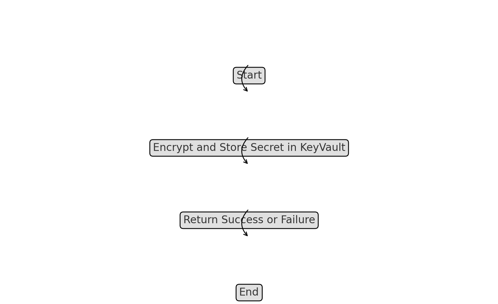

# Azure KeyVault Integration

The `k8s-admission-controller-drmax` integrates with Azure KeyVault to securely manage sensitive information such as secrets and certificates. This integration ensures that sensitive data is stored and accessed in a secure, compliant manner.

## Key Methods

### GetSecret

- **Method**: `GetSecret(key string) (string, error)`
- **Description**: Retrieves a secret from Azure KeyVault using the specified key. The method ensures that the secret is fetched securely and returned to the application for use. This is typically used for obtaining certificates, passwords, or other sensitive configuration data.

### StoreSecret

- **Method**: `StoreSecret(key string, value string) error`
- **Description**: Stores a new secret in Azure KeyVault under the specified key. This method ensures that the secret is securely stored and encrypted according to Azure's security standards. It is used to save sensitive data that the application may need to retrieve later.

### DeleteSecret

- **Method**: `DeleteSecret(key string) error`
- **Description**: Deletes a secret from Azure KeyVault. This method is used to remove sensitive data that is no longer needed or has been rotated, ensuring that outdated secrets do not remain accessible.

### UpdateSecret

- **Method**: `UpdateSecret(key string, value string) error`
- **Description**: Updates an existing secret in Azure KeyVault. This method is important for maintaining up-to-date configuration data, such as renewing certificates or changing API keys.

### Get Secret from Azure KeyVault Flowchart

### Store Secret in Azure KeyVault Flowchart

### Delete Secret from Azure KeyVault Flowchart

### Update Secret in Azure KeyVault Flowchart

