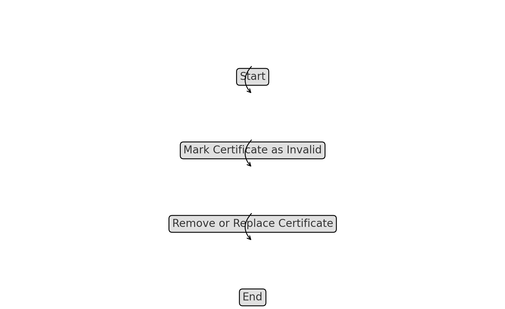

# Certificate Cache Manager

The Certificate Cache Manager in the `k8s-admission-controller-drmax` application is responsible for efficiently managing the storage and retrieval of certificates. Caching certificates reduces the need for repeated requests to the certificate authority, thereby improving performance and reliability.

## Key Components

### Cache Structure

- **File**: `pkg/certificatecache/certificatecache.go`
- **Description**: The certificate cache is implemented as an in-memory store, optimized for fast access and minimal latency. The cache structure includes metadata about each certificate, such as its expiration date, to facilitate quick lookups and validation.

### Key Methods

#### AddCertificate

- **Method**: `AddCertificate(name string, cert *Certificate)`
- **Description**: Adds a new certificate to the cache under the specified name. This method ensures that the certificate is stored with all relevant metadata, including its expiration date and any associated domains.

#### GetCertificate

- **Method**: `GetCertificate(name string) (*Certificate, error)`
- **Description**: Retrieves a certificate from the cache by its name. If the certificate is found and is still valid, it is returned to the caller; otherwise, an error is returned, indicating that the certificate is missing or expired.

#### InvalidateCertificate

- **Method**: `InvalidateCertificate(name string)`
- **Description**: Invalidates a certificate in the cache, marking it as expired or no longer valid. This method is typically called when a certificate is rotated or revoked, ensuring that outdated certificates are not used.

#### UpdateCertificate

- **Method**: `UpdateCertificate(name string, cert *Certificate)`
- **Description**: Updates an existing certificate in the cache. This method is useful when a certificate is renewed or reissued, as it allows the cache to maintain the most current version of the certificate.

### Add Certificate to Cache Flowchart

### Get Certificate from Cache Flowchart

### Invalidate Certificate Flowchart

### Update Certificate Flowchart

