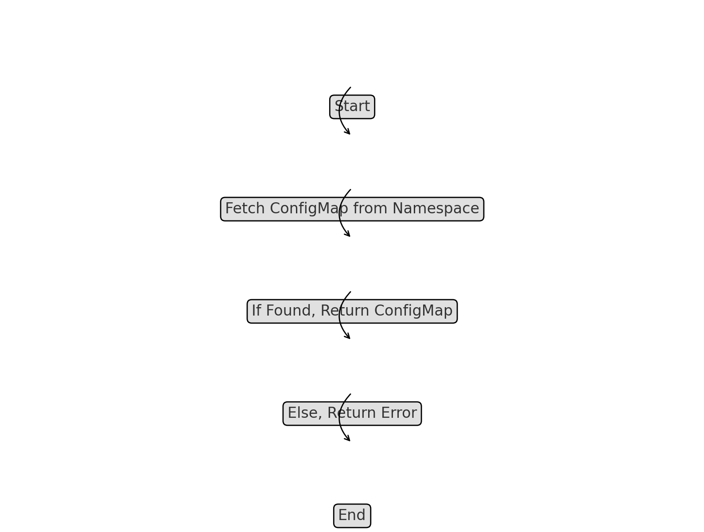
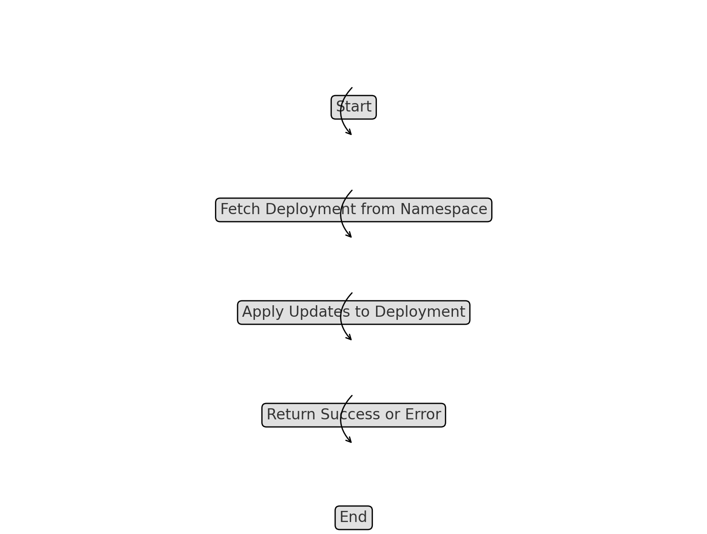
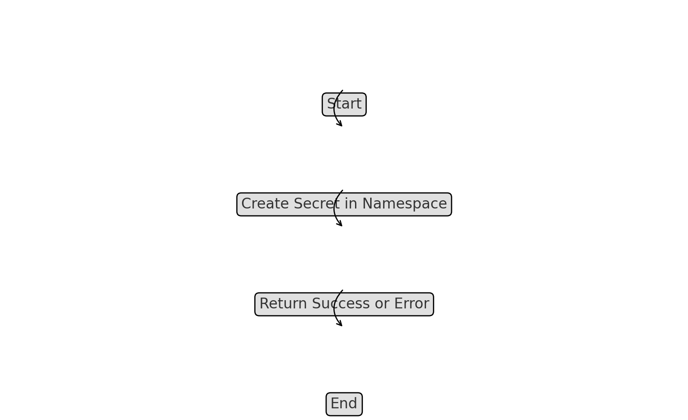
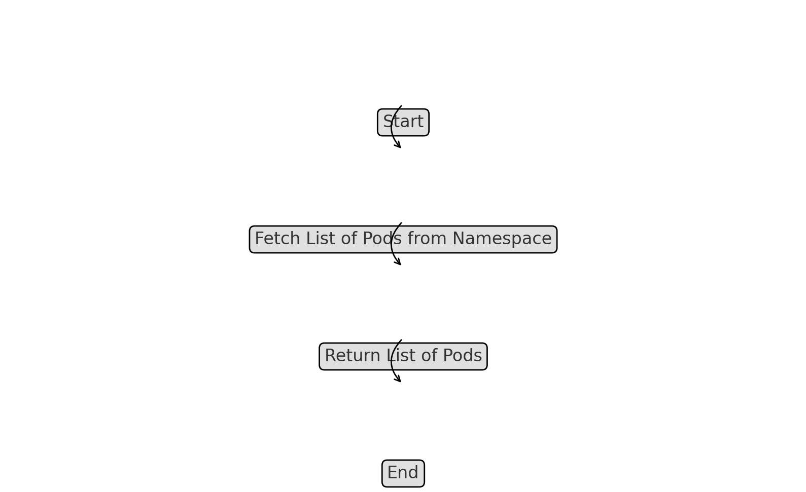

# Kubernetes Client Interactions

The Kubernetes client within the `k8s-admission-controller-drmax` is responsible for communicating with the Kubernetes API server. It performs various operations, such as retrieving and updating resources like ConfigMaps, Secrets, and Deployments.

## Key Methods

### GetConfigMap

- **Method**: `GetConfigMap(namespace string, name string) (*ConfigMap, error)`
- **Description**: Retrieves a ConfigMap from the specified namespace. This method is essential for accessing configuration data that is stored within the cluster, allowing the controller to adjust its behavior based on the ConfigMap's contents.

### UpdateDeployment

- **Method**: `UpdateDeployment(namespace string, deployment *Deployment) error`
- **Description**: Updates a Deployment resource in the specified namespace. This method is used to apply changes to deployment configurations, such as scaling the number of replicas or updating the container image version.

### CreateSecret

- **Method**: `CreateSecret(namespace string, secret *Secret) error`
- **Description**: Creates a new Secret in the specified namespace. This is typically used to store sensitive data such as API keys or certificates within the Kubernetes cluster.

### ListPods

- **Method**: `ListPods(namespace string) ([]Pod, error)`
- **Description**: Lists all Pods within a specified namespace. This method is useful for monitoring the status of applications running in the cluster or for debugging issues by inspecting Pod details.

### Get ConfigMap from Kubernetes Flowchart

### Update Deployment in Kubernetes Flowchart

### Create Secret in Kubernetes Flowchart

### List Pods in Kubernetes Flowchart

