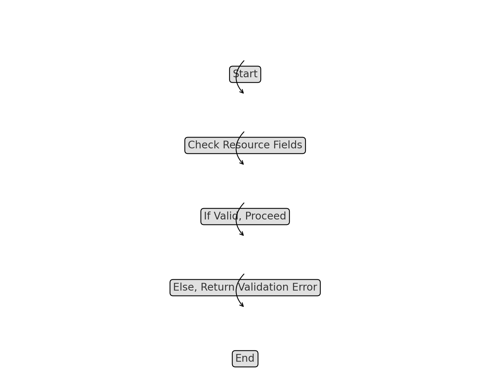
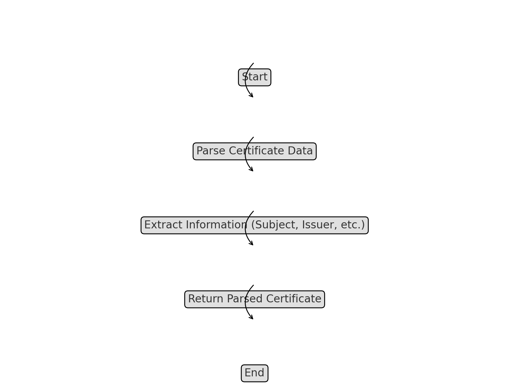
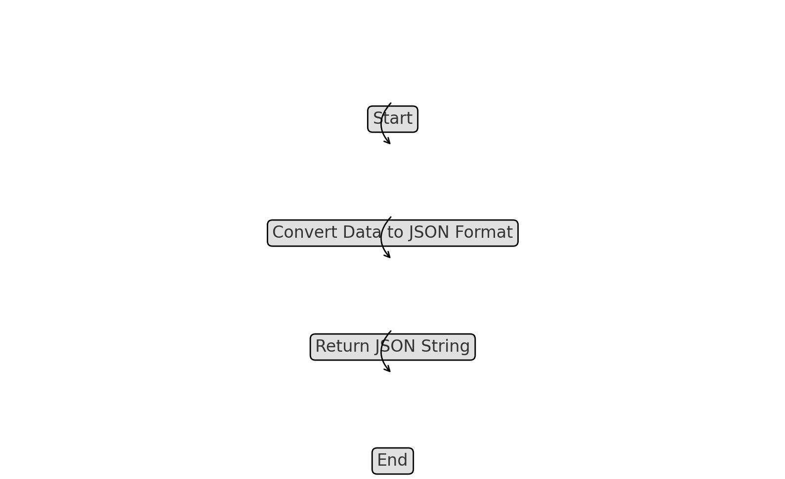
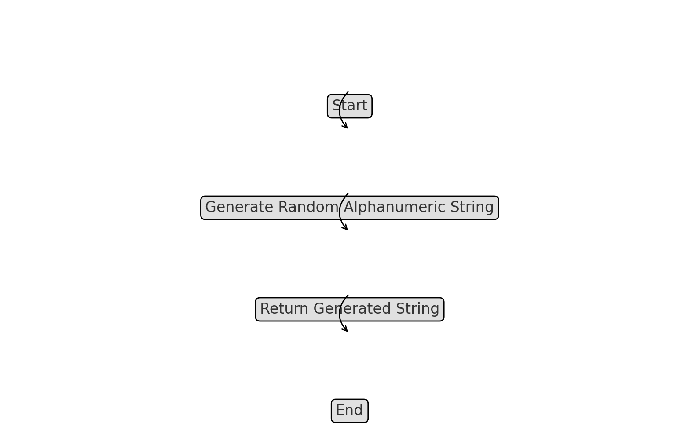

# Utility Functions

The `k8s-admission-controller-drmax` includes several utility functions that perform common tasks such as certificate parsing, field validation, and data conversion. These utilities help streamline the code and improve maintainability by centralizing repetitive tasks.

## Key Functions

### ValidateFields

- **File**: `pkg/utils/fieldValidatora.go`
- **Method**: `ValidateFields(resource interface{}) error`
- **Description**: Validates the fields of a Kubernetes resource to ensure they conform to required formats and constraints. This function checks for the presence of mandatory fields, correct data types, and acceptable value ranges.

### ParseCertificate

- **File**: `pkg/utils/certHelpers.go`
- **Method**: `ParseCertificate(certData []byte) (*Certificate, error)`
- **Description**: Parses a PEM-encoded certificate and extracts key information such as the subject, issuer, validity period, and SANs. This function is crucial for validating and processing certificates before they are used by the controller.

### ConvertToJSON

- **File**: `pkg/utils/conversion.go`
- **Method**: `ConvertToJSON(data interface{}) (string, error)`
- **Description**: Converts a Go data structure into a JSON string. This utility is commonly used for logging or storing configuration data in a format that can be easily transmitted or stored.

### GenerateRandomString

- **File**: `pkg/utils/stringHelpers.go`
- **Method**: `GenerateRandomString(length int) (string, error)`
- **Description**: Generates a random alphanumeric string of the specified length. This function is typically used to create random identifiers or tokens for resources within the controller.

### Validate Fields Flowchart

### Parse Certificate Flowchart

### Convert to JSON Flowchart

### Generate Random String Flowchart

