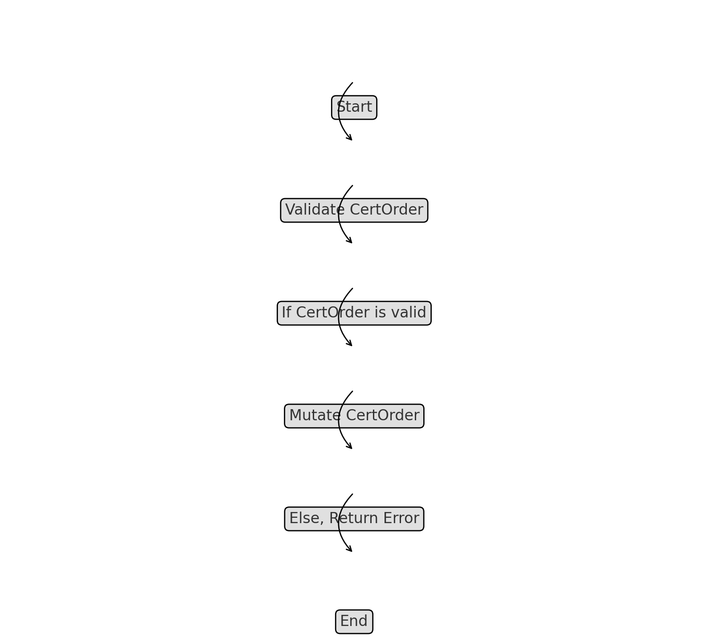
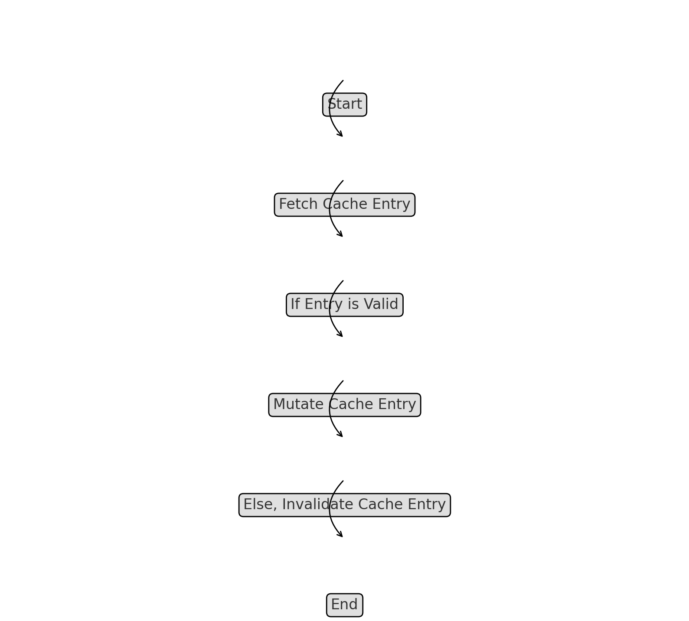
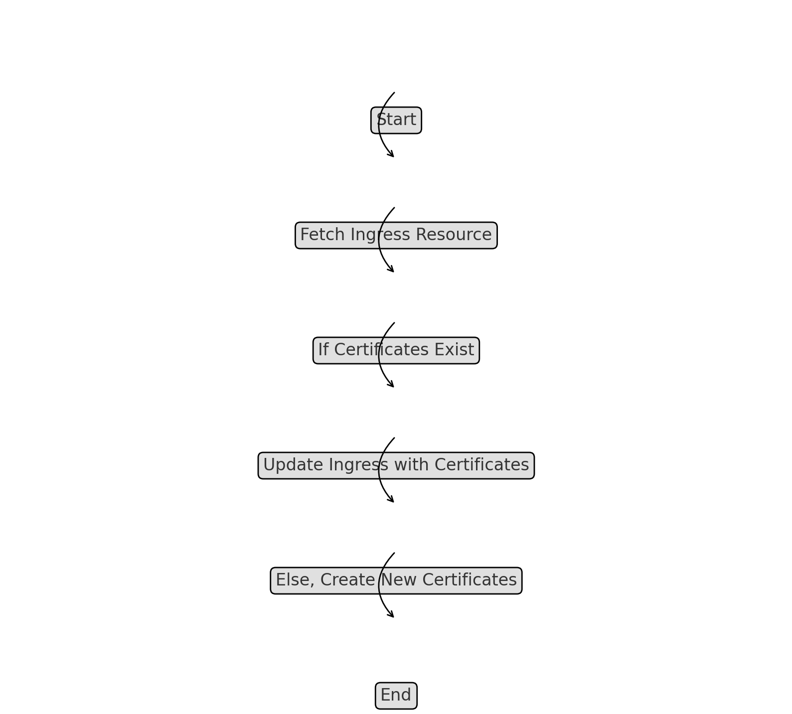
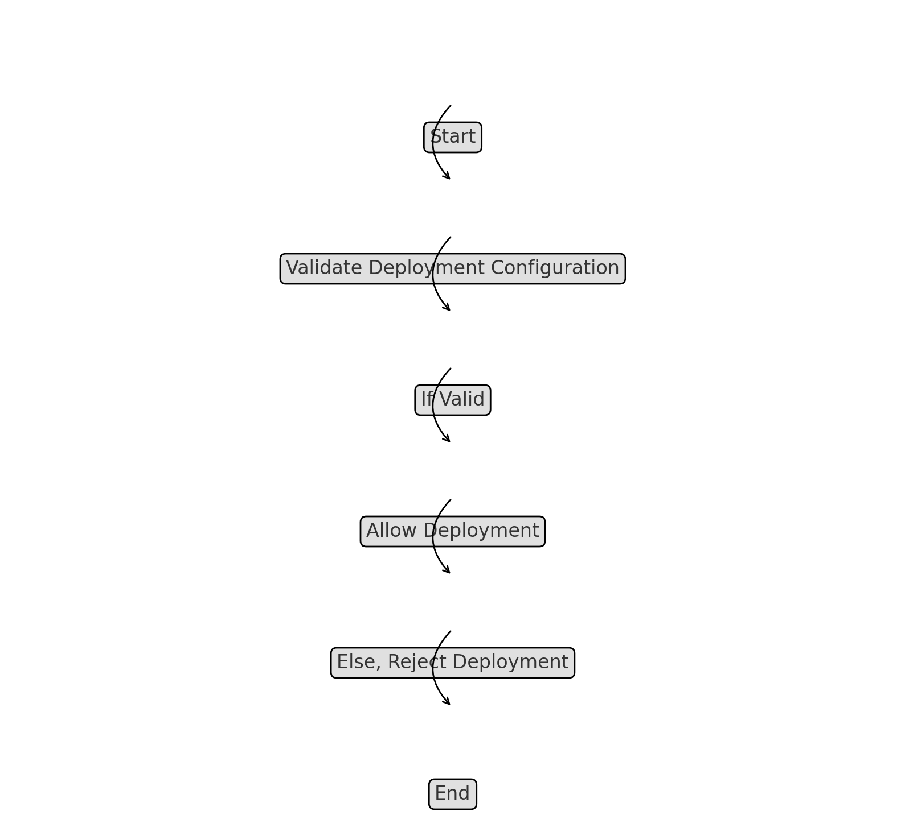

# Webhooks Documentation

This section provides a comprehensive overview of the webhooks implemented in the `k8s-admission-controller-drmax` project. Webhooks are critical components that intercept Kubernetes API requests, allowing the controller to enforce security policies and modify resource configurations.

## Mutation Webhooks

### Certificate Order Mutator

- **File**: `pkg/webhook/mutation/certOrderMutator.go`
- **Description**: The Certificate Order Mutator is responsible for processing incoming certificate orders. It ensures that all certificate requests meet the organization's policies, such as correct Common Name (CN) and Subject Alternative Names (SANs). It can automatically adjust configurations to comply with security requirements.

  - **Key Methods**:
    - `MutateCertOrder(certOrder *CertOrder)`: Intercepts a `CertOrder` object, validates its fields, and mutates it to conform with policy requirements. This method ensures that the requested certificates are properly formatted before they are processed by the certificate authority (CA).

### Certificate Cache Mutator

- **File**: `pkg/webhook/mutation/certificateCacheMutator.go`
- **Description**: The Certificate Cache Mutator ensures that entries in the certificate cache are up-to-date and correctly formatted. This mutator is critical for maintaining the integrity and performance of the certificate cache, which is used to store frequently accessed certificates.

  - **Key Methods**:
    - `MutateCacheEntry(entry *CacheEntry)`: Modifies cache entries to ensure they are valid and consistent. This includes updating metadata, adjusting expiration times, and ensuring that cached certificates meet current security standards.

### Ingress Certificates Mutator

- **File**: `pkg/webhook/mutation/ingressCertsMutator.go`
- **Description**: This mutator handles the automatic injection of certificate data into Kubernetes Ingress resources. It ensures that Ingress resources are properly configured with the necessary certificates for TLS termination.

  - **Key Methods**:
    - `MutateIngress(ingress *Ingress)`: Processes an Ingress resource, attaching the correct certificates and annotations required for secure TLS termination. It checks for existing certificates and either updates them or injects new ones as needed.

## Validation Webhooks

### Deployment Validator

- **File**: `pkg/webhook/validation/deployment.go`
- **Description**: The Deployment Validator is used to enforce security policies on Kubernetes Deployment objects. It validates the deployment's configuration to ensure that it adheres to best practices, such as using approved container images and securing sensitive data.

  - **Key Methods**:
    - `ValidateDeployment(deployment *Deployment)`: Validates a `Deployment` object to ensure it meets predefined security and operational standards. This includes checks on container images, environment variables, and resource limits.

### General Validator

- **File**: `pkg/webhook/validation/validator.go`
- **Description**: This general validation webhook is designed to enforce policies across various Kubernetes resources. It ensures that resources such as ConfigMaps, Secrets, and Services are configured securely and correctly.

  - **Key Methods**:
    - `ValidateResource(resource interface{})`: A generic validation function that can be applied to any Kubernetes resource. It checks the resource's configuration against a set of policies and either approves or rejects the request based on compliance.

### Certificate Order Mutator Flowchart

### Cache Entry Mutator Flowchart

### Ingress Certificates Mutator Flowchart

### Deployment Validator Flowchart

